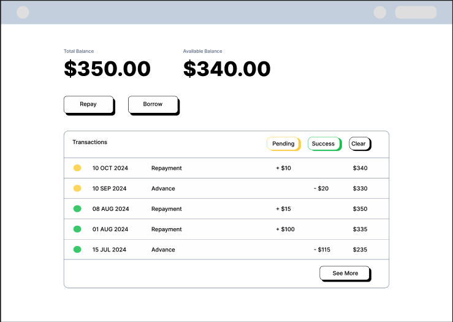
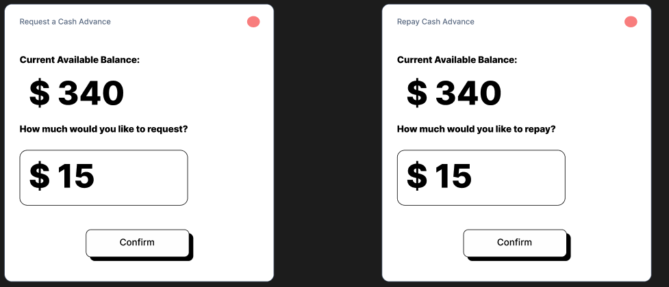
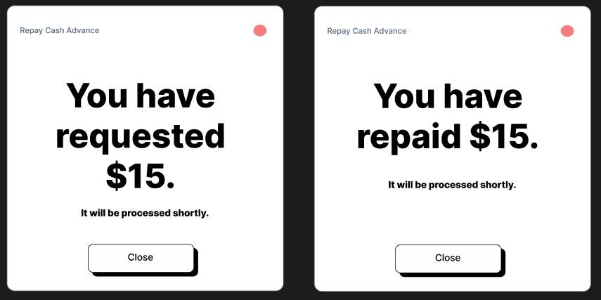
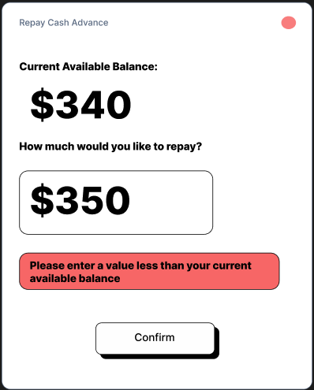
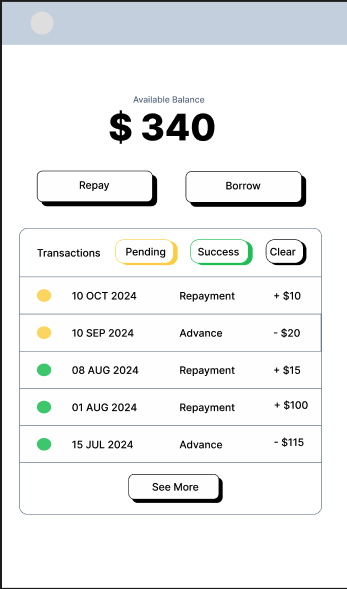

This is a [Next.js](https://nextjs.org) project bootstrapped with [`create-next-app`](https://nextjs.org/docs/app/api-reference/cli/create-next-app).

## Running the App

First, install the dependencies. Navigate to the root folder of the project within a terminal and run this command:

```bash
npm install
```

If some dependencies do not install, make sure you are using Node version `v20.18.0`

Then, run the development server:

```bash
npm run dev
```

Once the server is running, open [http://localhost:3000](http://localhost:3000) with your browser to see the dashboard.

## Testing the App

I have created basic tests for the main page component of the application. To perform these unit tests run the command below:

```bash
npm run test
```

## Design Decisions

During the design phase the main aspects that were considered were my use of friendly/approachable design, spacing, color schemes, typography, consistency with similar apps, and accessibility. My initial design phase itself consisted of creating high-level figma mock-ups that were iteratively improved to adhere to these principles:

#### Friendliness

For this design, I aimed to limit the total amount of information presented, making it easy to follow and digest, while being enhanced by the interactivity and simplicity of the UI. Therefore, components like the main balance sections were limited to a simple heading and only the required information. Moreover, a friendly/interactive button and transaction table styling was employed to make the app more approachable for users. Finally, assuming this was an application used within the Bree ecosystem, it was considered beneficial to mimic some of their styling (i.e. from the Bree landing page).

#### Spacing

To maintain proper spacing, I created a design that utilizes white space to control the information hierarchy, grouping related elements together and separating those that differ in meaning or functionality (i.e. grouping the filter buttons closer together, grouping financial numbers closer together, etc.).

In terms of alignment, minimizing the number of left alignments created by each element on the screen resulted in a more professional and easy-to-follow UI/UX. For example, for my final design I decided to update the main balance and action buttons to be left-aligned (They were orignally center aligned on both mobile and web). Similarly, right-aligning the “See More” button with the filters also contributed to these improvements (This button was also center aligned).

#### Color Scheme

I decided on a neutral color palette with blue and yellow accents to indicate completed and pending states. Through research, I found that blue often evokes a sense of stability and trust, which made it a great choice for the completed state of the application. Moreover, yellow is used in many cases to indicate a waiting or pending state (i.e. traffic lights) so using that color for a similar purpose would seem intuitive to users. I also utilized green accents on the repayment transactions to emphasize their meaning and help users visually differ them from the advancement transactions.

#### Typography

I chose the Inter font for its consistency and its ability to clearly display important information, such as numbers and dates, which were crucial for this type of application. It is also well optimized for web applications.

#### Consistency With Similar Apps

To ensure the layout was consistent with other popular cash management apps, the main visual flow from top to bottom began with a clear view of the user's primary balance data, followed by buttons for performing actions, and concluded with a list of relevant account information, such as transactions.

#### Accessiblity

To enhance accessibility, I ensured several key features were included in the design. I implemented `motion-reduced:transition-none` to disable transitions on relevant components for users who had set a motion-reduced preference on their devices. I utilized appropriate HTML elements, such as `<ol>` for the transaction list and `<h1>` for titles and headings, to provide better semantic structure. Additionally, I applied Tailwind CSS media query utility classes to ensure app responsiveness and usability across multiple devices. Furthermore, I incorporated shapes in addition to colors for status icons to accommodate users with color blindness.

#### Initial Figma Mock-Ups

Main Dashboard


Inital Modal State


Confirmed Modal State


Errored Modal State


Mobile View


#### Final Design and Incremental Features

During development, many design improvements were made on top of my intial figma design. Some of these improvements were talked about in my design principle explanations. Here is a list of other improvements I made to enhance the user experience:

- Updated the wording of the balance headings to be more descriptive and clear
- Improved the wording of the modal prompts to be more descriptive
- Added smooth transition hover states on the transactions to display extra information

##### Incremental Features

- Added a header and footer to add to the apps professional and trustworthy look (The profile button was simply placed as a visual addition, but has no functionality for now)
- Added business day wait times to give users a more comfortable sense of how long they needed to wait for a transaction to be complete
- Added a "Total Completed Cash Advance Balance" alongside the "Available Cash Advance Balance" to show users what their current balance is considering only completed transactions. This was added as I considered it an important piece of information that allows users to know how much they have planned to borrow or repay regardless of the status of pending transactions.
- Added the account balance alongside the transaction data for each transaction.

## Challenges

Here are a list of challenges I encountered during this assignment:

- The approach of having state updates dependent on one another proved ineffective (in my case it was the available cash advance balance state and the transaction list). They depended on each other because the balance that showed on the transaction list had to match the balance on the dashboard for newly added balances. These two states would update everytime a new transaction was confirmed. I realized it was poor practice to allow states to rely on each other, so I shifted the implementation by combining the transaction list and balance states into a single object, which ultimately resolved the issue.
- In general, the transition animations for the main buttons, modal, and hover states were sort of challenging at first, but through research and testing I was able to get them to work.
- It was my first time working with Jest to implement component unit tests, so initially there was a learning curve.
